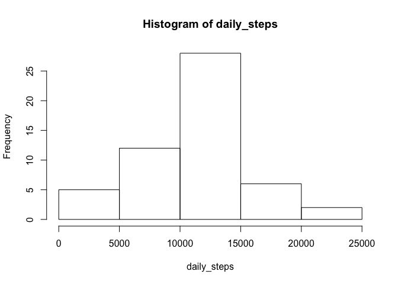
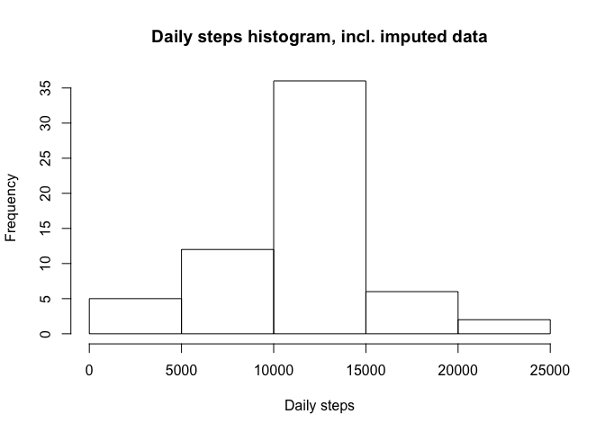

# Reproducible Research: Peer Assessment 1

## Loading and preprocessing the data

```r
#download data files; unzip to working directory
if(!file.exists("~/Projects/RepData_PeerAssessment1")) dir.create("~/Projects/RepData_PeerAssessment1")
setwd("~/Projects/RepData_PeerAssessment1")
file_URL <- "https://d396qusza40orc.cloudfront.net/repdata%2Fdata%2Factivity.zip"
download.file(file_URL, destfile = "./activity.zip")
unzip("./activity.zip")


# load data

activity <- read.csv("./activity.csv", header = TRUE)

#convert factor into date format
activity[, 2] <- as.Date(activity[, 2], format = "%Y-%m-%d")

# remove na from activity data
act_na <- !is.na(activity[,1])
act_clean <- activity[act_na, ]
```

## What is mean total number of steps taken per day? 


```r
# calculate total steps by day and build histogram
daily_steps <- tapply(act_clean$steps, act_clean$date, sum)
hist(daily_steps)
```

<!-- -->

```r
## What is the average daily activity pattern?
# calculate mean and median steps taken per day
mean_steps <- mean(daily_steps)
median_steps <- median(daily_steps)
# print(c("mean number of steps =", mean_steps))
# print(c("median number of steps =", median_steps))
```
Mean number of steps = 10766.19.
Median number of steps = 10765.


```r
# create a graph of 5 minute intervals 
time_intervals <- tapply(act_clean$steps, act_clean$interval, mean)
plot(row.names(time_intervals), time_intervals, type = "l", ylab = "mean across all weeks", xlab = "5 min interval", main = "Mean steps taken in a given time interval")
```

<!-- -->

```r
#estimate the time interval with highest mean daily value
# print(c("interval with highest mean daily value", names(which.max(time_intervals))))
```
Interval with highest mean daily value is 835.

## Imputing missing values

```r
library(lubridate)
```

```
## 
## Attaching package: 'lubridate'
```

```
## The following object is masked from 'package:base':
## 
##     date
```

```r
library(lattice)


# create parallel file with imputed values; use daily means as na substitute
time_intervals <- data.frame(names(time_intervals), time_intervals)

for (i in 1:nrow(activity)) {
       if (is.na(activity[i, 1])) {
             activity[i, 1] = time_intervals[match(activity[i, 3], time_intervals$names.time_intervals.), 2]
         }}

# calculate total steps by day and build histogram, incl. imputed data
daily_steps_i <- tapply(activity$steps, activity$date, sum)
hist(daily_steps_i, xlab = "Daily steps", main = "Daily steps histogram, incl. imputed data")
```

<!-- -->

```r
# calculate mean and median, incl. imputed data
mean_steps_i <- mean(daily_steps_i)
median_steps_i <- median(daily_steps_i)
```

Mean number of steps, incl. imputed data = 10766.19.
Median number of steps, incl. imputed data = 10766.19.

Adding imputed values affected median slightly and eliminated the difference between mean and median values.


## Are there differences in activity patterns between weekdays and weekends?

```r
# create weekend/weekday factor variable in data set complete with imputed data
activity$wd <- as.character("")
wdf <- c(1,7)
for (i in 1:nrow(activity)) {
      if (wday(activity[i, 2]) %in% wdf) {activity[i, 4] <- "weekend"} 
            else {activity[i, 4] <- "weekday"}
    }


# make a panel plot of 5 min intervals across days for weekends/weekdays
time_intervals_wd <- aggregate(steps ~ interval + wd, activity, mean)
xyplot(steps ~ interval | wd, time_intervals_wd, type = "l", layout = c(1,2))
```

<!-- -->
